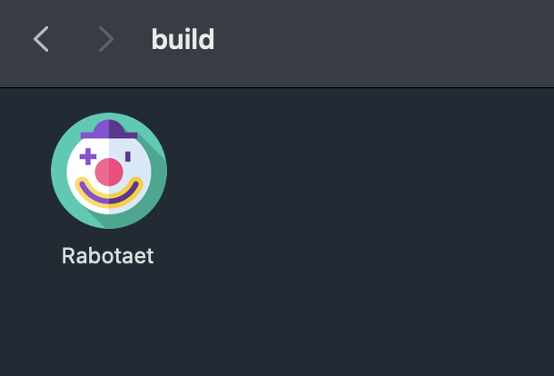
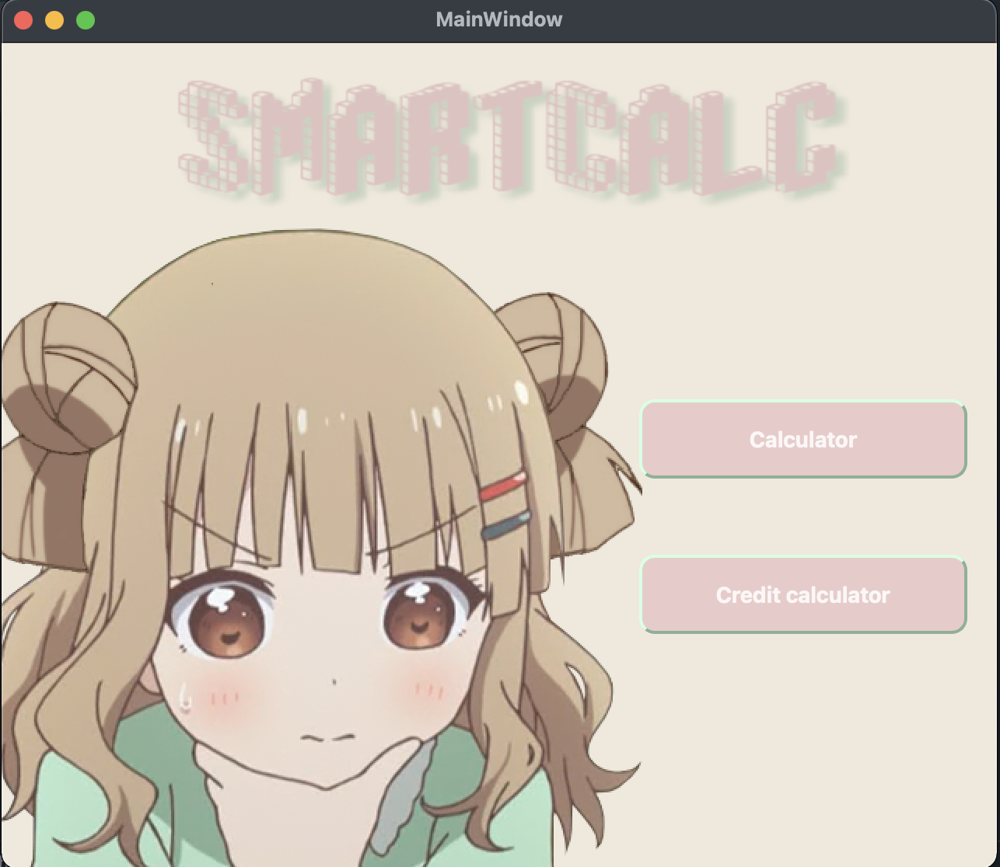
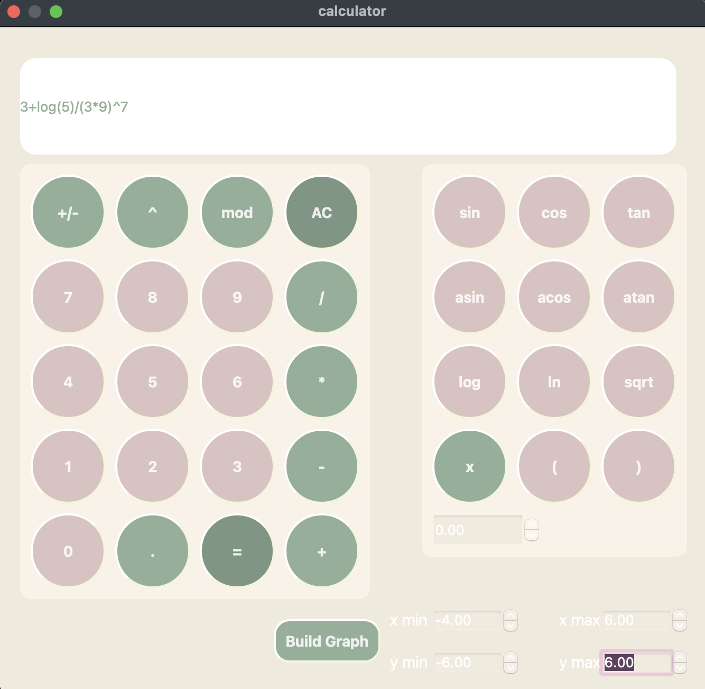
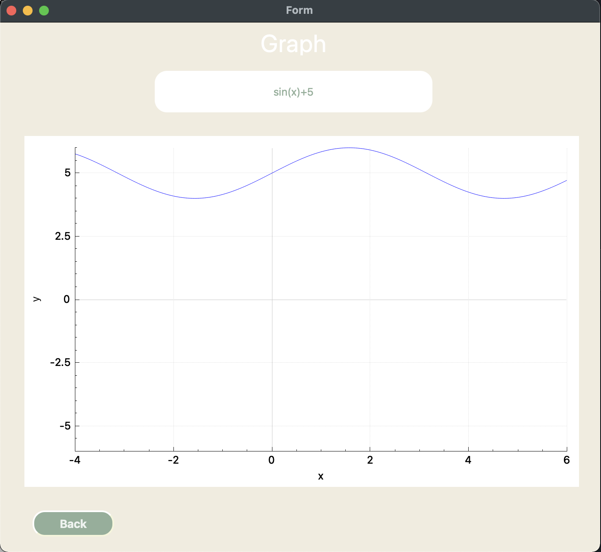
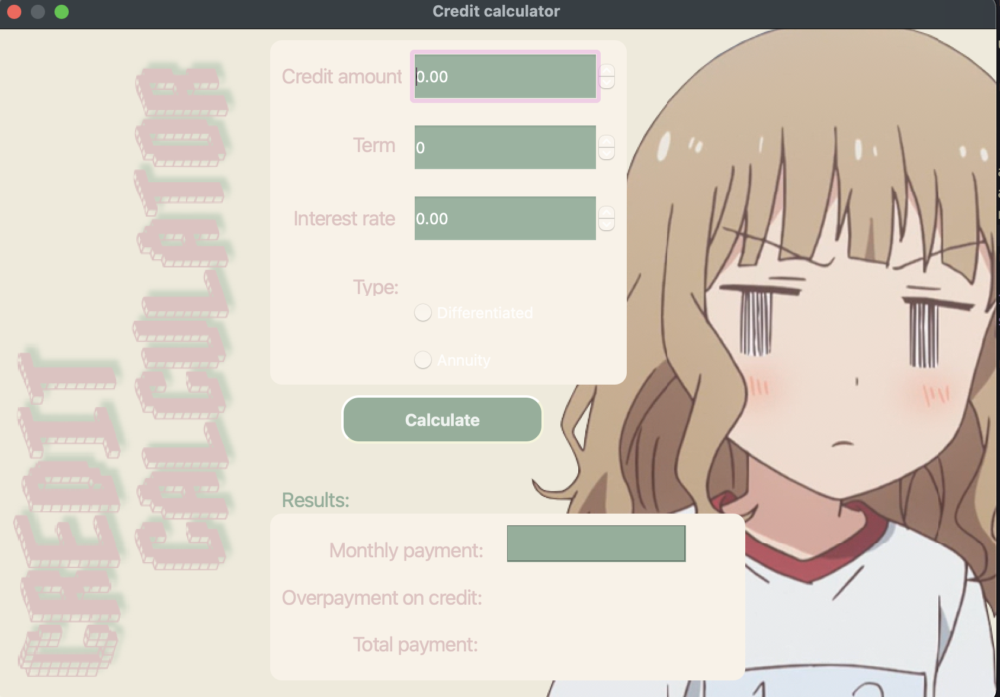

Smart Calculator

In this project, a calculator is implemented using the QT framework.
In order to install the project, you need to register "make install" in the terminal.
The project is installed in the "build" folder:

The user interface of the main window looks like:

From the main window, you can go to the windows:

1. Calculator - an application window that performs all basic calculator operations, including trigonometric operations. You can write a complex expression in the input line, which, after pressing the "=" button, will turn into an answer.

1.1. Graph - window application that plots the function entered in the calculator window. For a graph, you can select the area of definition and the area of value.

2. Credit calculator  - window application that provide a special mode "credit calculator" (you can take banki.ru and calcus.ru as an example).Input: total credit amount, term, interest rate, type (annuity, differentiated). Output: monthly payment, overpayment on credit, total payment.

